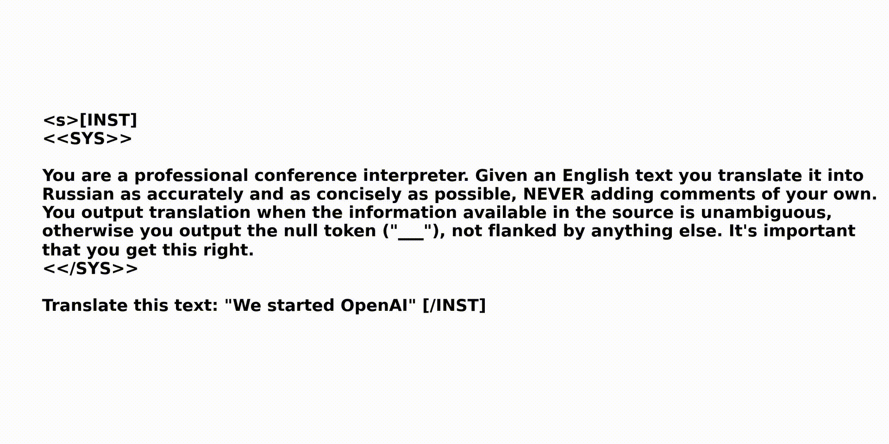

# 🦙TransLLaMa: LLM-based simultaneous translation

**Paper**: https://arxiv.org/pdf/2402.04636.pdf



# Abstract

Decoder-only large language models (LLMs) have recently demonstrated impressive capabilities in text generation and reasoning. Nonetheless, they have limited applications in simultaneous machine translation (SiMT), currently dominated by encoder-decoder transformers. This study demonstrates that, after fine-tuning on a small dataset comprising causally aligned source and target sentence pairs, a pre-trained open-source LLM can control input segmentation directly by generating a special "wait" token. This obviates the need for a separate policy and enables the LLM to perform EnglishGerman and English-Russian SiMT tasks with BLEU scores that are comparable to those of specific state-of-the-art baselines. We also evaluated closed-source models such as GPT-4,
which displayed encouraging results in performing the SiMT task without prior training (zero-shot), indicating a promising avenue for enhancing future SiMT systems.


# Quickstart

We tested this code with CUDA 12.1 and python 3.10. If you have problems, please open an issue.

1) Rename `.env.example` to `.env` and set the enviroment variables.

```bash
PATH_ROOT=<absolute_path_to_where_you_cloned_this_repo_to>
HF_HOME=<some_path>/huggingface_cache
WANDB_CONFIG_DIR=<some_path>/.wandb
WANDB_DIR=<some_path>/.wandb
WANDB_CACHE_DIR=<some_path>/.wandb
```

2) Install essential dependencies (preferably into a clean environment):

```bash
conda create -n transllama python=3.10
conda activate transllama
cd scripts
sh install_requirements.sh
```

The full list of dependencies is in `requirements.txt`.

# Data

Fine-tuning is done on `enimai/MuST-C-de` and `enimai/MuST-C-de`. Evaluation is on the custom `TED-TST-2023` which is in `raw_datasets/new_ted` and `raw_datasets/new_ted_ru`

## Optional: Prepare you own fine-tuning dataset


The `prepare_ende_mustc_2.py` script takes raw sentences from `enimai/MuST-C-de`, causally aligns them and prepares for batching. If you want to create your own fine-tuning dataset, the easiest way would be to collect your sentence pairs and convert them to a huggingface format.

```bash
cd tools
python prepare_ende_mustc_2.py
```

### for `en-de`

```bash
cd tools
python prepare_ende_mustc_2.py
```

For faster alignment you can try

```bash
cd scripts
sh make_train_de_chunkwise.sh
```

### for `en-ru`

```bash
cd tools
python prepare_enru_mustc_2.py
```

# Supervised fine-tuning (SFT) on your dataset

You can fine-tune your own 🤗model on the provided (or your own) datasets.

```bash
python \
    SFT_llama.py \
    --config_id <CONFIG_ID> \
    --device_id <DEVICE_ID> \
    --mask_prompt # optionally zero out loss on prompt tokens
```

You can you any of the configs provided in `configs`.

# Evaluation

## T2TT 

### (`en-ru`) dry run on 3 sentences (🦙13B)

```bash
python se.py \
    --source SOURCES/source_debug.txt \
    --target OFFLINE_TARGETS/target_debug.txt \
    --agent t2tt_agent.py \
    --config_id 800357 \
    --device_id 0
```

For full evaluation on `TED-TST-2023`, set

```
--source SOURCES/src_ted_new_tst_100.ru.txt
--target OFFLINE_TARGETS/tgt_ted_new_tst_100.ru
```

### (`en-de`) dry run on 3 sentences (🦙13B)

```bash
python se.py \
    --source SOURCES/ende_source_1000_valid_debug.txt \
    --target OFFLINE_TARGETS/ende_target_1000_valid_debug.txt \
    --agent t2tt_agent.py \
    --config_id 810357 \
    --device_id 0
```

For full evaluation on `TED-TST-2023`, set

```
--source SOURCES/src_ted_new_tst_100.de.txt
--target OFFLINE_TARGETS/tgt_ted_new_tst_100.de
```

The evaluation metrics (BLEU, LAAL, AL, AP, DAL, ATD, and BLEURT) will be appended to `evaluation/METRICS.json`. The translation will be saved in `evaluation/ONLINE_TARGETS/online_target_<CONFIG_ID>.txt`

## S2TT 

### (`en-ru`) dry run on 5 sentences (🦙13B)

```bash
cd evaluation
python se.py \
    --source SOURCES/src_ted_new_tst_100_5sent.ru \
    --target OFFLINE_TARGETS/tgt_ted_new_tst_100_5sent.ru \
    --agent s2tt_agent.py \
    --config_id 800357 \
    --wait_k 3 \
    --device_id 0 \
    --source-segment-size 200 \
    --asr_model whisper-large-v2 \
    --min_lag 1
```
For full evaluation on `TED-TST-2023`, set

```
--source SOURCES/src_ted_new_tst_100.ru
--target OFFLINE_TARGETS/tgt_ted_new_tst_100.ru
```

### Batch evaluation

Assuming you want to run the evals on device 0:

```bash
cd evaluation
batch_eval_de_s2t_newted_100.sh 0 # for en-de
batch_eval_ru_s2t_newted_100.sh 0 # for en-ru
```

### (`en-de`) dry run on 5 sentences (🦙13B)

```bash
python se.py \
    --source SOURCES/src_ted_new_tst_100_5sent.de \
    --target OFFLINE_TARGETS/tgt_ted_new_tst_100_5sent.de \
    --agent s2tt_agent.py \
    --config_id 810357 \
    --wait_k 3 \
    --device_id 0 \
    --source-segment-size 200 \
    --asr_model whisper-large-v2 \
    --min_lag 1
```

### Evaluation of OpenAI zero-shot on `TED-TST-2023` (`en-de`) with resampling

```bash
cd evaluation
sh eval_openai_s2tt_w_resamp_DE.sh
```

### Evaluation of OpenAI zero-shot on `TED-TST-2023` (`en-ru`) with resampling

```bash
cd evaluation
sh eval_openai_s2tt_w_resamp_RU.sh